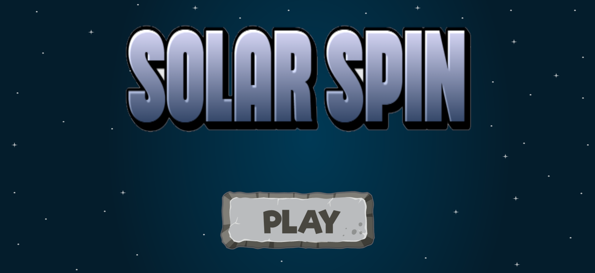
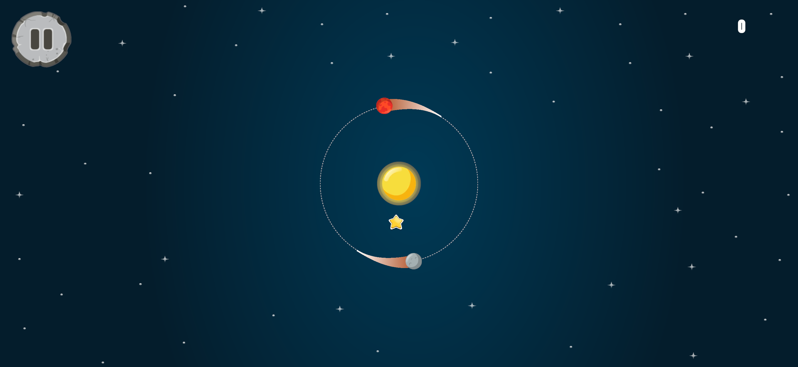
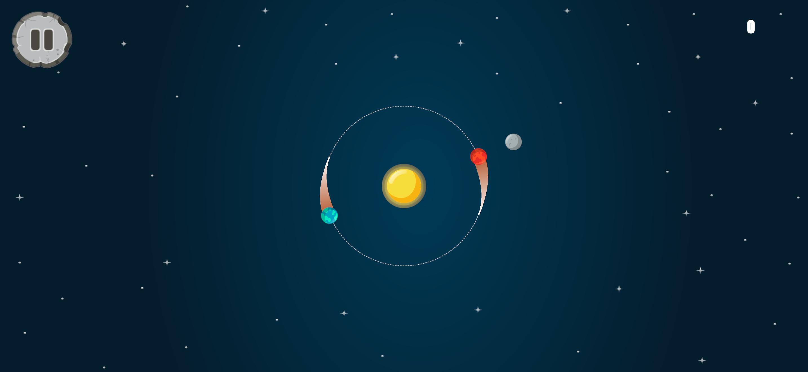

# ☀️ Solar Spin

**Solar Spin** là một trò chơi arcade nhanh và đầy thử thách, nơi bạn điều khiển hai hành tinh quay quanh mặt trời trong không gian. Hai hành tinh luôn chuyển động trên cùng một quỹ đạo và đối diện nhau, tạo nên một vòng quay liên tục. Chỉ với một thao tác chạm, bạn có thể đổi hướng quay để né tránh các chướng ngại vật đang lao từ ngoài vũ trụ vào tâm.

Trong quá trình chơi, các khối năng lượng nhiều màu sắc sẽ xuất hiện. Bạn cần điều khiển hành tinh va chạm với khối năng lượng có màu trùng với hành tinh để ghi điểm. Nếu va chạm với màu không đúng, trò chơi sẽ kết thúc. Ngoài ra, các ngôi sao xuất hiện trong không gian sẽ giúp bạn nhận thêm điểm thưởng khi thu thập được.

---

## 🎮 Gameplay

- 🪐 Điều khiển **hai hành tinh quay quanh mặt trời**
- 👆 Chạm vào màn hình để **đổi hướng quay**
- 🎨 Va chạm **đúng màu với trap** để ghi điểm
- ❌ Va chạm **sai màu sẽ Game Over**
- ⭐ Thu thập **Star để nhận +10 điểm**

---

## 🕹 Controls

| Action | Description |
|------|-------------|
| 👆 Tap / Click | Đổi hướng quay của hai hành tinh |

---

## 🏆 Objective

Cố gắng ghi được **số điểm cao nhất** bằng cách né tránh chướng ngại vật và va chạm đúng màu trong khi các hành tinh quay quanh mặt trời.

---

## 📷 Screenshots

---

## 🛠 Built With

- 🎮 Unity
- 💻 C#
- 📱 Mobile Arcade Gameplay

---

## 🚀 Features

- 🌌 Space themed gameplay
- 🪐 Dual planet control system
- 🎨 Color matching mechanics
- ⭐ Star bonus system
- 📈 High score tracking
